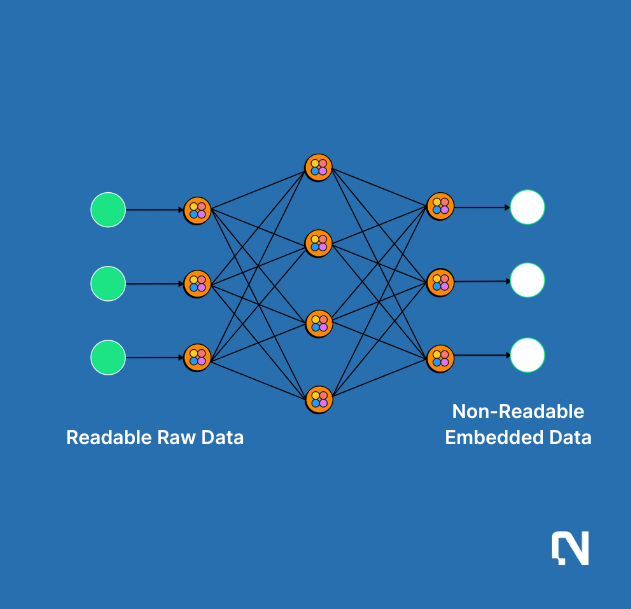

# Nimble Policies

## Context

At Nimble Network, we recognize the critical importance of privacy and security, especially when it comes to handling sensitive data in on-chain machine learning environments. As we expand our ecosystem, ensuring that all data is protected and used ethically is a must.

## Nimble Policies

Nimble policies are privacy and security rules as defined in the Nimble Matrix. It defines the security and privacy policies as being honored by the network validators. A policy is an object in Nimble Matrix, associated with resource constraints, access permissions and performance SLAs. Permissions decide whether a request is allowed or denied. Policies are stored as structured blurbs such as JSON documents.

Let us look at the same example from the [Nimble Matrix](https://docs.nimble.technology/nimble-doc/nimble-architecture/nimble-matrix) illustration. To recap, consider an AI developer named 'Bob' who uses a dataset called 'health-bodyscan-image-set' and connects with a GPU provider from 'US-california-40GRAM' to develop large image classification models. Data privacy policies are provided for secure AI training. The model can be pubicly shared to anyone, while data is only accessible on the network as embeddings. Such polices are honored by validators and GPU providers.

| 
0x9760 (as Bob's address) {     code_snippet:  "0x9760_train.py",     max_pay: "20 $NIM",

    max_time_duration: "7200 seconds",

    matching_strategy: "cost efficient",

    data_strategy: "standard",

    model_privacy: "public",     ....

}
 | 
0x7044 (as bodyscan data provider's address) {     header: "['userid', 'img', 'label_class_5']",     min_price: "10 $NIM",

    samping_strategy: "cluster",

    min_storage: "100GB"

    matching_strategy: "max earning",

    data_privacy: "embedding",     ....

} 
 |
| ------------------------------------------------------------------------------------------------------------------------------------------------------------------------------------------------------------------------------------------------------------------------------------------------- | ---------------------------------------------------------------------------------------------------------------------------------------------------------------------------------------------------------------------------------------------------------------------------------------------------------------------- |
| 
0x3695 (as california GPU provider's address) {     GRAM: "40GB",     max_storage: "200GB",      matching_strategy: "stable revenue",     min_price: "5 $NIM",

    virtualization: "true"

    ...

}
                                                       | 
0xV354 (as validator) {     type: matching,     storage: 100GB,     estimated_duration: "6600 seconds",     output_dir: "ds:0x9760/".     data_strategy: "encryption",     state: validated ....

}
                                                                                |

## Case Study: Privacy Preserving AI

Still taking an AI training example, consider the data being shared by models across the network. Data providers can provide and define privacy policy to share data only in the format of embeddings for example.

Instead of training models or performing inference on raw data, we use a sophisticated embedding technique. This method involves transforming sensitive data into another dimensional space, which represents the essential information without exposing the raw data. This process not only secures the data but also enhances processing efficiency and protects user privacy.

**1.Privacy Protection**: By converting raw data into embeddings, personal identifiers are removed, ensuring that the data cannot be traced back to any individual.

**2.Reduced Data Abuse Risk**: Embeddings minimize the detailed information that can be exploited, thus significantly lowering the risk of data misuse.

<figure><figcaption></figcaption></figure>

To further safeguard our data of embedding, all communications within the Nimble Network will be encrypted. This encryption applies to data as it moves between nodes and while it is at rest, ensuring that only authorized nodes can access or interpret the information.

Data embedding technique sheds light on a wide spectrum of privacy technologies being adopted by the network:\
\
**1. User Level Privacy:** The privacy of individuals in datasets is one of the most important topics being studied in privacy preserving AI. In Nimble, federated cohort learning and differential privacy are adopted as being used by big tech companies like Google and Facebook in large scale search, recommendation and ads AI systems. In this way, Nimble provides reliable privacy services for data partners with well proved technologies.

**2. AI Model Privacy:** Secret dataset evaluations and embedding based techniques help miners to keep AI model privacy by not sharing the model files, raw data for training, hyperparameters, model architectures and training process publicly. In this way, they can keep an edge in Nimble network for certain models and AI agents. Techniques such as adversarial training are developed to improve the robustness of AI models by proactively generating adversarial training examples.

**3. Research Driven Approach:** Privacy and security are paramount in everything we do at Nimble Network. To build a comprehensive policy system, Nimble has adopted a research driven approach by exploring new privacy and security techniques and improve the network continuously. For example, recent trends such as zkML and FHE are great privacy solutions that can become mainstream gradually. The team is working with various privacy solution partners for open research. Once they are ready for efficient and large scale deployments, Nimble will adopt them in production as well.
