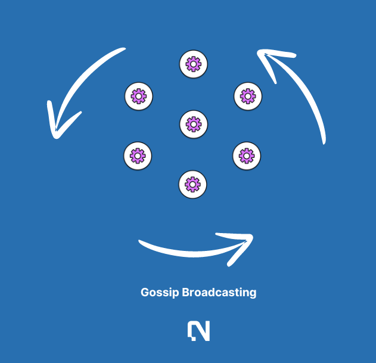

# Nimble Validators

## Context

Nimble validators govern the AI orderbook with Proof of Stake. Miners are evaluated by validators to perform real work and build reputations on the network.

Matching structured Nimble Matrix DSLs with miners involves both communication efficiency and dispatching efficiency. In the AI-centric world, the efficient handling of information requests across distributed networks has become imperative. With the Nimble Network, we introduce a cutting-edge Peer-to-Peer (P2P) network that seamlessly integrates a Nimble Matrix for efficient and precise network processing and dispatching across nodes.&#x20;

The core of validator efficiency comes to two types of validator traffic essential for supporting the AI Orderbook.

## Validador <> Validator

Gossip protocols is used for several purposes:

**1.State Synchronization**: Validators can use gossip to keep their state information (like blockchain state, configuration, or operational metrics) synchronized with each other.

**2.Service Discovery**: Validators can propagate information about available services, like GPU availability or data service updates, throughout the network.

**3.Failure Detection**: Validators can quickly share alerts about node failures or connectivity issues, allowing the network to adapt and respond rapidly.

<figure><figcaption></figcaption></figure>

## Validator <> GPU/Data/Developer/Applications

In a landscape as dynamic as the Nimble Network, standard communication protocols often fall short. They can be too rigid or overly broad, failing to address the specific needs and nuances of our decentralized ecosystem. Our DSL is crafted to bridge this gap, providing precise, efficient, and flexible communication tailored to the unique demands of our network. Nimble network uses PubSub model to transmit messages across the network. In that way, it is more efficient as messages are only sent to interested subscribers, thereby reducing redundancy and network load.

**1. Integration with Nimble Matrix:** The DSL is fully integrated with our Nimble Matrix, an innovative framework that groups and maps resources across our network. This integration allows for seamless queries and commands related to resource allocation, monitoring, and transactional operations, ensuring a smooth and coherent experience.

**2. Clean and Efficienct:** From querying the status of a GPU to fetching data with specific privacy settings, our DSL makes managing resources straightforward. It supports complex, multi-step operations and can adapt to the network’s changing needs, enhancing our ability to scale and evolve.

**3. Enhanced Security:** Security is paramount in everything we do at Nimble Network. Our DSL includes robust security protocols to authenticate commands and protect against unauthorized access, ensuring that our network remains secure and trustworthy.

<figure><figcaption></figcaption></figure>

## Attack Management

As a piece of public infrastructure, Nimble will be subject to dishonest and fraudulent behavior. This section details how the system responds to a variety of attacks.

### Miner Reputation

A reputation system is required to ensure high-quality and automated miner selection via AI orderbook.

The reputations are built by validators via permissionless AI evaluation solutions Nimble has built in-house. In AI training, checkpoints (i.e., intermediate model states) are leveraged for truthful model iterations on batch data. For inferences, inference redundancy builds reputations for low reputation miners by cross-checking with multiple high reputation miners in the network.

As an orchestration layer, the network needs signals from the community in order to select truthful miners. For this purpose, we aim to implement miner reputations. Reputation is built as a weighted sum of staking (optional, yet critical), and a history of user feedback. In this way, low-quality miners are selected out of the network automatically, and high-quality miners are chosen more often.

Solutions proposed by miners who repeatedly provide invalid solutions will be rejected automatically.

### Sybil Attacks

Sybil attacks are a type of fraud where many identities are created by one or a few individuals. It happens mostly for new identities and nodes. Nimble employs three strategies to prevent Sybil attacks:

* New nodes (e.g., users, miners, and validators) without existing reputations are likely Sybil nodes. As a result, they are placed under suspicion by other nodes on the network. They can prove their honesty with more network token stakes and a history of interactions with other nodes.
* Each node locally maintains social trust (decentralized, and nodes may have different social trust scores for the same node). To minimize the cost of the social trust-building process, nodes can exchange social trust scores. In this way, a good player can establish its reputation faster, while low reputation nodes find it hard to build reputations.
* The social trust system has another good side effect. It rewards early contributors to the network (e.g., miners, users, and validators). This is helpful for the network jumpstart and the philosophy that the network rewards early contributions.

### DDoS Attacks

DDoS attacks happen when users and miners send bulk requests for the purpose of overwhelming the system. Attackers may create large amounts of spam operations (or solutions) that are invalid and make it difficult to select legitimate requests or solutions.

To prevent this, there are two things to be implemented:&#x20;

* Introducing fee markets by charging a fee for operations
* The miner with a high reputation can rate the operations and, thus, users. Low-rated requests should be dropped by the network

The above is just a list of critical security and verification considerations of operation. There are more considerations in the code.

### Efficient Dispatching 

Dispatching takes place at the orderbook level and each node will autonomously determine the most appropriate path to fulfill the request, it sends different types of requests to Nimble mempools accordingly.

**Validator Mempool**

After AI requests get recognized, and a solved understandable request data will be generated, and broadcasted to each peer node, and temporarily stored in a mempool on each node. Once an operation gets picked up and handled, it will be removed from the mempool.

**AI Extensibility**

Nimble operations are extensible by design with flexible operation data structures and operators. Default ones are provided for commonly used operations. Advanced users can always customize their own operation request operators and data.&#x20;

Operation data consists of a) operation id - unique id for efficient search in the distributed hash table, b) operation metadata - operation types, timestamp and sender, and c) operation payload - any operation logic related data and non-logic related data.AI operation request operators are any functions provided for operation data.

Typical ones include but not limited to a) operation evaluator - evaluate operations with returned numerical metrics, b) operation comparator - compare two operations using the evaluator functions and return boolean to show user preferences among them, and c) verify - perform sanity checks of operations with success and error code returns.With the above design, operation extensibility is easily achieved.

**Matching Efficiency**

Matching problem is a notoriously difficult problem to solve, by matching preferences of two sets of entities - users and miners in this case. To be more precise, it is to match AI operation goals with miner solutions. There are several considerations to optimize efficiency.

First, each miner only evaluates AI requests of a particular type in the modular auction design. An auction algorithm within the dispatching layer determines the most suitable miner node for each request. Miner nodes bid for the right to process requests based on their capabilities, load, and other dynamic factors. The dispatching layer assigns each request to the winning bidder, ensuring optimal resource allocation and timely processing, and miners are responsible for constructing the operation solution to be handled. When a miner starts constructing solutions for operations, it will pick up the operations first, and then send a message to notify all the peers, removing those operations from the mempool.

Even if the above design limits the complexity to the number of requests N for the particular request type, the time complexity is still N \* M where M is the number of miners. Operations are thus batched and miners bid for each batch. This is combined with miner reputations, which boost miner's chances of participating in the auctions. Each modular auction is thus organized in a hierarchical tree where high reputation miners participate in the auction first. Miners can boost their reputation with more stakes and better operation AI solutions. This will reduce the time complexity on the miner side to log\_k(N\*M/x) where k is the fanout of the miner reputation tree and x is the average number of operations in a batch.

Dispatchers reduce network cost with structured design, though flooding is the most intuitive yet also costly approach. AI operation map is a buffer map with all neighboring peers’ operation lists. First, each node keeps separate operation maps for each operation type. This reduces the network cost since a node can request operation maps for particular operation types. Second, the operation maps are organized as a tree for efficient search and storage in local nodes. The search time is only log\_O where O is the number of operation types on the network. Such modular operation map design also enables dispatching nodes to select operation types based on the operation rewards and dispatcher node capacities. Dispatchers are network aware of each other’s bandwidth and computation capacities. In this way, they can build a more efficient overlay network with capacity aware neighboring peer selections.

Now, the network is scalable with the growth of operation types, miners, and dispatchers.

**Double Dispatching**\
Double dispatching happens when two or more miners execute the same operation. Obviously, dispatchers are not doing a good job if this happens. It is catastrophic like double spending in Bitcoin.

To start, each operation mainly has 5 states - a) SENT, b) VERIFIED, c) ALLOCATED, d) SOLVED, and e) INVALID. Users mark operations as SENT before publishing them to the network. It is marked by network nodes as VERIFIED after calling the verify function which returns success. INVALID is used to mark it as operations not being able to be processed by the network. SOLVED is the state to mark operations as being solved already, after being ALLOCATED to miners with winner bids.

The most naive way to prevent double dispatching is that each operation carries a lock. The lock only allows one node to modify operation states. Yet, this has a lot of scalability issues without fully utilizing the processing power of the network. Our solution to this is any node can modify operation states other than SOLVED. Nodes do not need to derive states like VERIFIED by themselves. Remember each node is connected with a list of other nodes it trusts. A weighted sum of its neighbors’ operation states is already good enough. For the SOLVED state, only the miner has the permission to change it and it can propagate across the network with log\_P where P is the number of nodes on the network. The solution miner is verified by the signature when they are granted the permission to resolve an operation. The miner has no incentive to cheat since it wants to receive network rewards. Network rewards are distributed when ⅔ nodes reach consensus around the operation SOLVED state.

