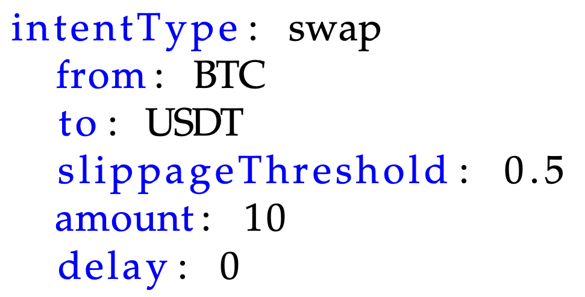
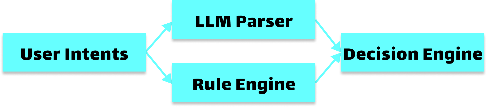

# Standardize Intents - Structured DSL and Intent LLMs

<figure><figcaption>
<strong>Figure 2:</strong> Intent taxonomy is a forest of intent trees, each of which represents an independent intent category.
</figcaption></figure>

## Define Intents with DSL

A Domain Specific Language is a programming language with a higher level of abstraction optimized for a specific class of problems. A DSL uses the concepts and rules from the field or domain. In Web3, different intents are defined in a structured manner as a configuration or a piece of code. Below is a simple example intent “swap 10 BTC for USDT at maximum 0.5% slippage instantly.”

<figure><figcaption></figcaption></figure>

To have unambiguous definitions, tree based ontology is adopted. Ontology, as a branch of philosophy, is the science of what is, of the kinds and structures of objects. In simple terms, ontology seeks the classification and explanation of entities.

Nimble taxonomy is a forest formed by a set of trees. In computer science, a tree is a widely used abstract data type that represents a hierarchical tree structure with a set of connected nodes. Each node in the tree can be connected to many children (depending on the type of tree), but must be connected to exactly one parent, except for the root node, which has no parent (i.e., the root node as the top-most node in the tree hierarchy).

Each tree defines an independent category. The root is the largest concept for that category. The leaf is a particular operation defined by DSL. The forest is extensible by adding new trees for new operation categories with the evolution of the Web3 concepts. Trees can be extended by adding new operations. In the example above, new derivative types can be added constantly as nodes and leaves.

The forest and leaf operations can be defined as a set of configuration files or specific code languages. The specific implementation does not matter too much only if it is accurate. For example, operations can be defined as EVM, Move or Rust smart contract functions, while the forest is defined as configurations. An alternative can define both as contract programs.

As a result, our definition of intent is extensible, accurate and flexible.

## Understand Intents with LLMs

Despite the extensible, accurate and flexible DSL definitions, it is impossible for users to learn it before. Thus, the user intents can be in arbitrary format. It can be natural languages or GUI inputs from DApps. Due to the structured nature of intent definitions, tgoal of intent understanding is to parse the arbitrary user inputs into specific leaf nodes in our intent taxonomy.

The intent understanding module is a combination of LLMs and rule engine. There is a wide literature on explaining them. Basically, rule engines define specific patterns to parse user input queries while LLMs are a large model of neural network used for pattern identification.

* Rule engine: It defines a set of patterns to process the intents and map intents to leaf nodes in the taxonomy forest (i.e., specific intent operations).
* LLM Parser: LLMs are used for intent natural language understanding with named entity tagging by identifying salient entities, followed by specific operation classifications.
* Decision Engine: Decision engine is to combine the operation classification outputs with another AI model for intent operation prediction precision boosting.

<figure><figcaption>
<strong>Figure 3:</strong> Intent recognizer.
</figcaption></figure>
