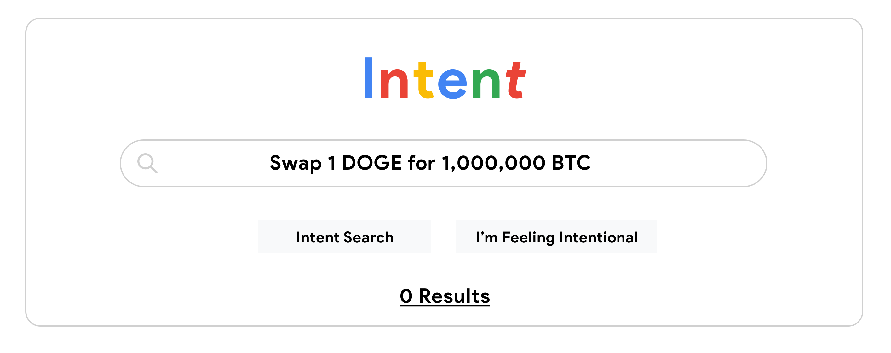
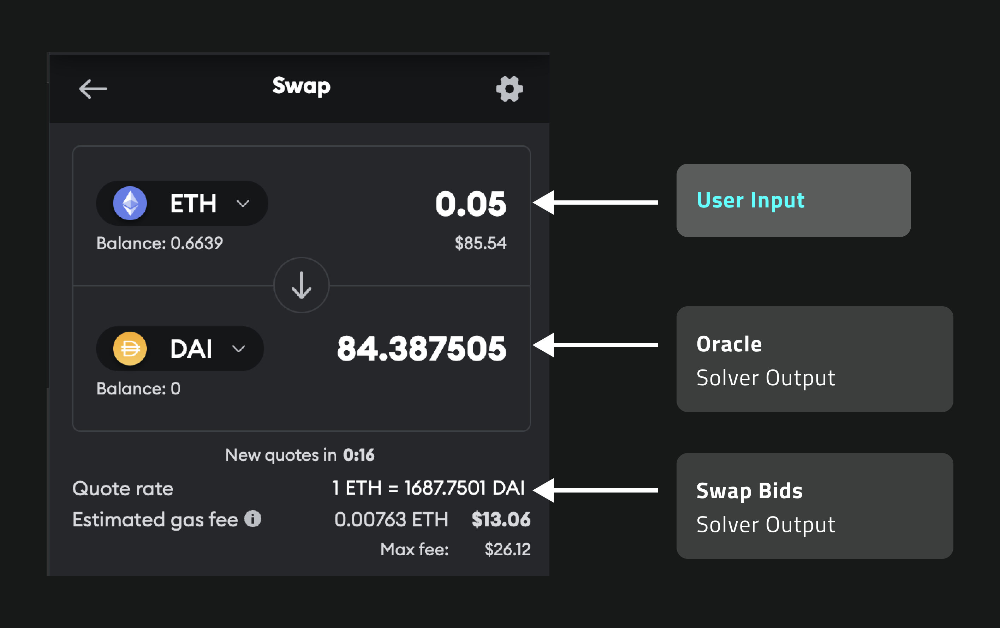
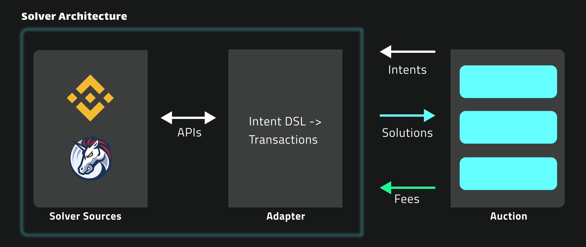

# Marketplace Applications

### Background

Web3 usability has come into sharp focus in the last few years - and for a good reason. The ecosystem is fragmented, with over 1,000 blockchains in circulation as of 2023. Operations on these chains still require low-level processes and specialized domain knowledge.&#x20;

Many projects have appeared recently to solve these problems. Aggregators reduce fragmentation by combining exchanges. Bridges connect disconnected chains. Account abstraction removes the need to sign every transaction.

Following these developments, Intents have come along as the unifying abstraction. This article explores several applications of Intents to show their role in producing a more accessible, usable, and inclusive Web3 ecosystem. We also describe where they fall short in user-facing applications.

## Applications of Intents

Let’s explore Intents by walking through a few applications, starting with the most commonly shared example: Token Swaps.

### Token Swap

#### **End-User Experience**

Intents lets users specify the outcome they are willing to accept instead of computational steps. The intent protocol translates the outcome into steps on the user’s behalf. Intents, then, are just an abstraction.

Abstractions are not magic.

<figure><figcaption>
Would you take this trade?
</figcaption></figure>

For new users, this creates a problem. By directly exposing an interface to a user that allows for desired outcomes to be specified and fulfilled, wishful thinking emerges.

I am willing to accept 1 BTC in exchange for 0.1 ETH. This state of the world is fine by me, but who would fulfill it?

Without structure around intents, users may want to submit nonsense intents that will never be fulfilled. Since virtually all transactions will occur at or near the market value for a given token, users need access to data to decide on an acceptable outcome. Then, once those values are determined, they need to act quickly to submit the transaction.

In my sample trade above, I need to know the market price for BTC and ETH and a rough idea of what transaction fees might be. I need this information to understand what an acceptable outcome looks like.

That’s a lot of manual data collection for a user wanting to swap some tokens.

If an intent protocol merely exposes a conversational interface allowing users to specify intents as text, there has been almost zero improvement to usability.

For this reason, we’ve chosen to build our intent protocol for developers and solvers, not end-users. Only a good product designer can determine which contextual information is important for tasks within their application. Given the breadth of functionality we envision for Nimble (ex., SocialFi, DeFi, decentralized gaming), that context will vary widely.

In our view, raw intents should not be exposed to end-users.

#### **Developer Experience**

Instead, consider a developer’s experience building an intent-driven token swap into their wallet application.

<figure><figcaption></figcaption></figure>

The developer understands that when users want to perform a basic swap, they have three pieces of information freely available.

1. The starting token type
2. The destination token
3. The quantity

The rest of the information must come from the market. If it were up to the user, they’d receive the destination tokens for free and pay no fees. It’s up to the developer to expose the user to the market rate.

The application does that by leveraging Oracle and Swap solvers to provide exchange rates and fees at the best possible market rate.

The benefit for developers is clear:

1. Removes the need for Web2 developers to re-tool to develop for Web3. Blockchain interactions are written as intents in a simplified language instead of blockchain-native languages like Solidity or Rust.
2. Lower costs and higher performance. Intents automatically leverage Nimble’s entire solver network for a given operation. As more solvers come online, solver competition will drive down costs across the whole network.
3. Less code. Even for seasoned Web3 developers, performing optimizations provided by Nimble would require 100s of lines of code.
4. Better code quality. Since intents are plain English, any developer can immediately understand what they’re trying to do.&#x20;

By abstracting away blockchain-related details from developers, intents lower the barrier of entry to Web3 development. Making blockchain more accessible to developers is the way to improve usability throughout the entire ecosystem.&#x20;

Or, as Steve Ballmer at Microsoft would say:&#x20;

[https://www.youtube.com/watch?v=EMldOiiG1Ko\&t=2s\&ab\_channel=fb](https://www.youtube.com/watch?v=EMldOiiG1Ko\&t=2s\&ab\_channel=fb)

#### **Solver Experience**

Solvers power the Nimble ecosystem by providing possible solutions satisfying user’s desired outcomes.

<figure><figcaption></figcaption></figure>

When an application submits an intent on behalf of a user, Nimble interprets the text and breaks the entire intent into a set of discrete Intent Operations. The protocol runs auctions for each Intent Operations and a composite auction for compound operations. In this simple example, only the swap auction is used.

To satisfy an intent operation -

1. The auction dispatches the swap intent operation to all participating solvers.
2. Each solver reaches out to their available data sources, identifying one or more possible solutions. For example, the swap solver may check liquidity pools from Binance or Uniswap to find the lowest overall swap cost.
3. The solver responds to the auction with a bid representing their best solution.
4. If accepted, the protocol executes the solution and compensates the solver.

This marketplace structure aligns the incentives of users and solvers by rewarding solvers who provide the best solutions. Contrast this with today’s MEV crisis, where the incentives are reversed.

### SocialFi and Decentralized Advertising

Social networks on Web3 have several advantages over their Web2 counterparts. Decentralization allows content creators to keep ownership of their audiences, rendering them portable. Content creators are protected against demonetization or arbitrary increases in platform fees by these facts.

Web3 social platforms have remained obscure, primarily because of usability issues. Let’s explore how a social network built on Nimble could provide a user experience identical to, or better than, today’s social media platforms.

#### **Sign up**

A user’s journey with any social platform begins by creating an account.

Signing up for dApps is a high-friction process today. Most Web2 users are lost immediately due to the unfamiliar workflows required to create an account in Web3 applications.

Nimble supports EIP-4337 account abstraction wallets. Users can create an account through these next-gen wallets by connecting their existing accounts from Facebook, Google, LinkedIn, etc. Through these tools, users don’t need to learn what a wallet or a private key is - they can just sign in.

#### **Content distribution**

Posting content on today’s social media networks is free. Networks receive funding by selling user data and ad space to advertisers. Advertisers bid on ad marketplaces to have their ads shown above the competition.&#x20;

<figure><figcaption></figcaption></figure>

Bid Simulator from Google Ads

A Web3 social network built on Nimble can support the same advertising model without downsides. The network would allow -

1. Content creators obtain a significantly higher portion of ad revenue
2. Advertisers can lower costs by eliminating high platform fees while maintaining ad targeting precision
3. Complete user control of advertisements and the ability to entirely opt out by paying for the use of the network

Let’s explore each of these roles in the Intent network ecosystem.

#### **Content creators and users**

Content creators are the drivers behind social network use. Their hard work supports the infinite scroll of our feeds on Instagram, TikTok, and YouTube.

In exchange for driving 100% of traffic to their platforms, social networks retain about half of all revenue generated.

<figure><figcaption></figcaption></figure>

Social networks built on Web3 provide audience portability. Content creators can freely move between platforms since the audience data is on a public blockchain. The user interaction layer is effectively decoupled from the data itself.

Unfortunately, the use of blockchain social networks today involves fees payable by the end user. Web2 users today are unwilling to pay to consume content on social networks, as evidenced by Twitter’s high-profile failure of Blue Check paid plans.

Nimble’s intent marketplace offers a solution to enable free-to-use Web3 social networks.

<figure><figcaption></figcaption></figure>

Nimble’s Intent Marketplace exposes a modular auction. Each auction module supports a single operation, including basic blockchain operations like swap, transfer, etc.

To enable Web3 social use cases, Nimble also supports “Publish Content” solvers that can participate in content publication auctions.

Advertisers may place bids to support content on the social network. In exchange for displaying the ads, the protocol compensates content creators and pays network fees.

Under the model, creators retain >90% of revenue.

### **Developer benefits**

As of 2023, there are about 30,000 global blockchain developers. Meta alone employs about 28,000 developers.&#x20;

To build a robust Web3 social network, we simply need more developers.

By building our protocol based on an intent-centric architecture, Nimble substantially reduces the barrier to entry for Web2 developers to start building on-chain apps. The overhead associated with interacting with the blockchain is abstracted away from developers, providing them with a high-level, intent-based interface.

For new developers, the experience of building a dApp is almost the same as building for Web2, unlocking a potentially massive pool of talent capable of supporting a robust social network on-chain.

### **Advertiser Benefits**

Social networks provide advertisers with the ability to create highly targeted ads. Online surveillance techniques aggregate user interests, enabling precise targeting. When users search for “trampolines” on Google, they know they’ll see trampoline ads for the next few months.

Like Facebook’s Graph database, a social network built on Nimble would provide a graph of user’s interests based on the accounts they follow and the content they interact with. The Intent Marketplace can submit metadata alongside each intent, passing these anonymized user targeting details to advertisers.

Users may opt out of targeted advertising on social networks in two ways.

First, they can simply pay to post their content. In this way, advertisers aren’t required to fund content publications. Second, they can submit privacy-preserving intents to the marketplace. Nimble uses ZK-proofs to protect user details from advertisers. In this case, the social network may still sell untargeted ads to advertisers at a lower cost.

Online advertising today is auction-driven. Advertisers place bids for keywords, and the network shows their ads to users interested in related topics. Nimble’s intent marketplace will provide advertisers with the same experience.

In the marketplace, advertisers are solvers, providing solutions to intents. Advertising solvers can place bids to have their ad shown alongside intents related to specific keywords, as submitted by the social network.

The social network can provide superior placement to ads that receive a higher bid, and route the earnings from the bid directly to the content creator.

By decentralizing advertising auctions, we eliminate the network middleman and drive down costs for advertisers.

### Conclusions

Intents are a useful tool for hiding complexity from users, but they need strong participation from the community to deliver functionality.

The community members - the solvers and validators - make Intents work.

We propose an intent marketplace structure to incentivize developers and solvers to support Nimble. Participation - and hence profit - can be earned at every level of the protocol. Early participants earn more since competition reduces profit.

We hope you’ll build with us soon.
