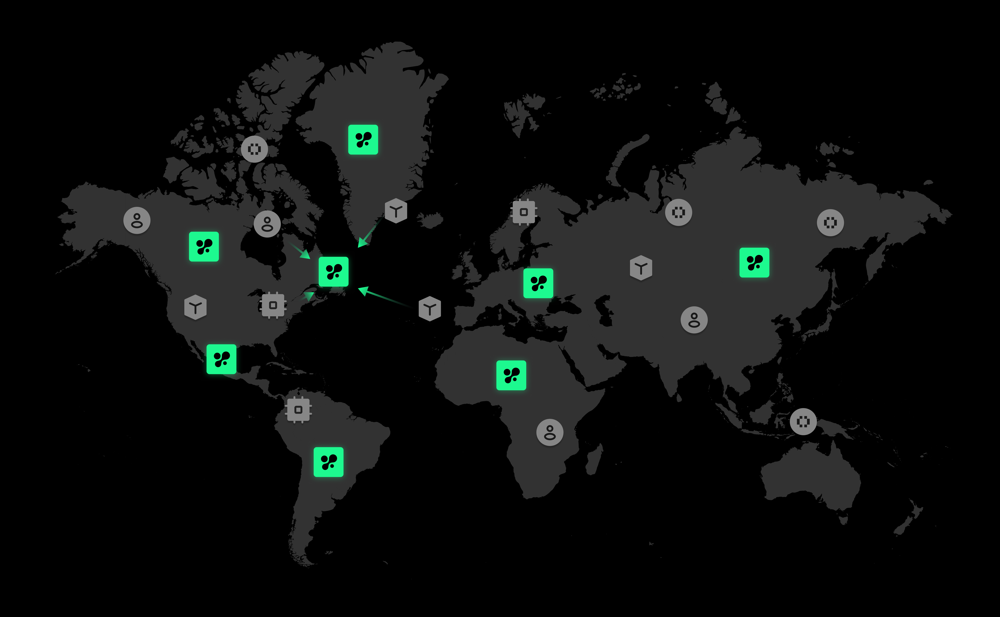

# 📖 Nimble AI Orderbook

Successful AI training hinges on three critical resources: compute power (GPUs), data, and developers. Each of these pillars faces its own set of challenges—from accessibility and scalability to efficiency. 

Similarly, AI inferences relies on computer power and application calls.

We call the whole system "AI Orderbook" as a one-stop shop that connects everything together on chain, covering both training and inference. 

## One Pager

The world is brimming with isolated islands of information, whether it's business use case, computational power, human expertise, or data. There are needs and there are resources. To effectively represent this multi-side information, we utilize the **Nimble Matrix** as the foundational element that flows throughout the world. This Matrix is processed, assembled, validated, and committed within the Nimble Network.

<figure><figcaption></figcaption></figure>

Nimble's job is to execute Matrix at the maximum efficiency. Thus AI OrderBook is designed for 3 phases.

* **Matching**: Identifies all potential combinations that meet the criteria of every participant.
* **Pricing**: Candidates bid to achieve the most favorable economic outcomes.
* **Transaction**: This step records the actual execution of training or inference.

Taking AI training as an example, please refer to the diagram below for an understanding of how matching, pricing, and transactions are sequentially executed for each Nimble Matrix.

<figure><figcaption></figcaption></figure>

## Nimble Matrix

The Nimble Matrix represents the fundamental elements flowing through the Orderbook. Still taking an AI training example, consider an AI developer named 'Bob' who uses a dataset called 'health-bodyscan-image-set' and connects with a GPU provider from 'US-california-40GRAM' to develop large image classification models. Here’s how the corresponding Nimble Matrix would be structured:

| 
0x9760 (as Bob's address) {     code_snippet:  "0x9760_train.py",     max_pay: "20 $NIM",

    max_time_duration: "7200 seconds",

    matching_strategy: "cost efficient",

    data_strategy: "standard",     ....

}
 | 
0x7044 (as bodyscan data provider's address) {     header: "['userid', 'img', 'label_class_5']",     min_price: "10 $NIM",

    samping_strategy: "cluster",

    min_storage: "100GB"

    matching_strategy: "max earning",     ....

} 
 |
| -------------------------------------------------------------------------------------------------------------------------------------------------------------------------------------------------------------------------------------------------------------- | --------------------------------------------------------------------------------------------------------------------------------------------------------------------------------------------------------------------------------------------------------------------------------- |
| 
0x3695 (as california GPU provider's address) {     GRAM: "40GB",     max_storage: "200GB",      matching_strategy: "stable revenue",     min_price: "5 $NIM",

    virtualization: "true"

    ...

}
                    | 
0xV354 (as validator) {     type: matching,     storage: 100GB,     estimated_duration: "6600 seconds",     output_dir: "ds:0x9760/".     data_strategy: "encryption",     state: validated ....

}
                                           |

The example provided is intended solely for matching purposes within the training flow; however, the same structure applies to subsequent steps and inference flows. Each step functions in a fully decentralized manner and is executed on-chain. Importantly, all operations are conducted on top of the Nimble Matrix.

