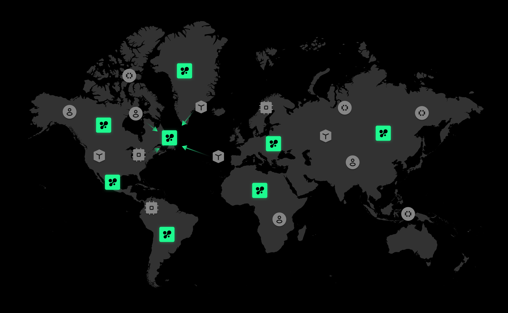

# Orchestration

## Context

The world is brimming with isolated islands of information, whether it's business use case, computational power, human expertise, or data. There are needs and there are resources. To effectively represent this multi-side information, we utilize the **Nimble Matrix** as the foundational element that flows throughout the world. This Matrix is processed, assembled, validated, and committed within the Nimble Network.

<figure><figcaption></figcaption></figure>

## OrderBook Design

Nimble's job is to execute Matrix at the maximum efficiency. Thus AI OrderBook is designed for 3 phases.

* **Matching**: Identifies all potential combinations that meet the criteria of every participant.
* **Pricing**: Candidates bid to achieve the most favorable economic outcomes.
* **Transaction**: This step records the actual execution of training or inference.

Taking AI training as an example, please refer to the diagram below for an understanding of how matching, pricing, and transactions are sequentially executed for each Nimble Matrix. Please refer to the [dedicated doc](https://docs.nimble.technology/nimble-doc/nimble-architecture/nimble-matrix) on Nimble Matrix for more details.

<figure><figcaption></figcaption></figure>

