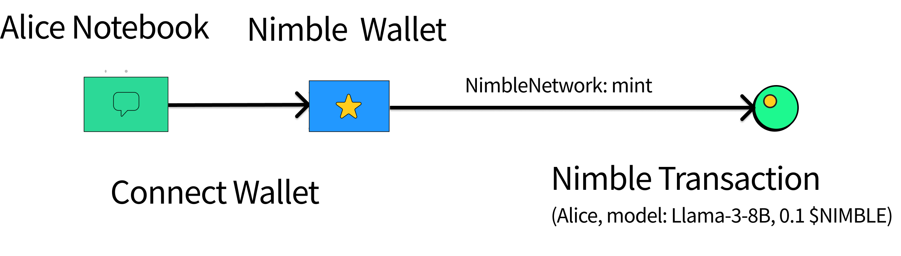

# Nimble Assets

## Context

Nimble connects AI agent creators, compute and data on one single platform. Everyone can create, own and trade such AI agents being represented as Nimble AI assets. The entire AI agent building, asset creation and trading workflow is permissionless.

Nimble assets are AI focused assets very different from Nimble network governance tokens. Such assets can be created by any AI agent creators.

## AI Notebook

AI notebook is the creator interface we offer to AI agent creators. Nimble SDK is accessible by creators via AI notebook. It facilitates resource matching among creators and infrastructure providers (e.g., data and gpu). Such resource matching includes data discovery, gpu scheduling and AI deployments. AI job monitoring services are built-in as well.

AI training and inference jobs initiated by the AI notebooks are the real network mining operations. The entire network builds AI agents as an ultimate outcome, producing net values with decentralized AI technologies.

The following video is an AI notebook demo of training and payment flows. Nimble SDK hides all the complexities of infra resource matching, pricing and AI transactions. AI notebook provides the optimal developer experience to create, build and monetize AI agents.


AI notebook built to optimize developer onboarding experience, orchestrated by AI orderbook.


## Asset Creation

AI agents trained and served on the network are mapped to assets. Asset creations are permissionless and such assets represent ownerships. They are tradable by community members. Being staked, asset owners earn fees from API calls and training of such AI agents.

The capital earnings of asset trading are used to purchase the computing power and other resources through the AI notebook for large AI agent building.

Nimble network charge a percentage fee for such AI asset creation, trading and resource matching. The fees are dynamic as governed by the AI orderbook.

<figure><figcaption>
Alice creates AI agents on Nimble network through AI notebook. The asset creation process happens on Nimble Network. AI agent asset creation fees are dynamic through the AI orderbook.
</figcaption></figure>

## Asset Trading

Aggregating all AI agent creations on Nimble network provides better and unified user experiences for creators. Yet, asset trading happens multi-chain by bridging the AI assets through different cross-chain bridges. A set of smart contracts are deployed multi-chain to facilitate such operations.

<figure><figcaption>
Alice creates the model on Nimble network and can trade it multi-chain. Bob purchases the model token shares and earns model ownerships. Take BNB chain as an example here. Such operations can happen on different chains.
</figcaption></figure>

