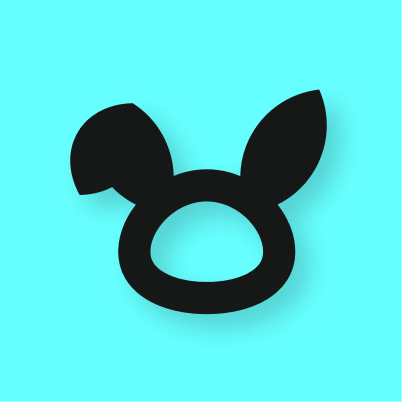
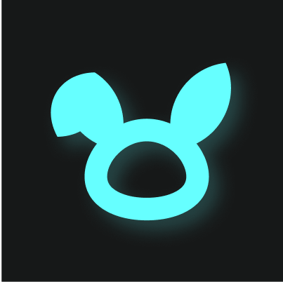
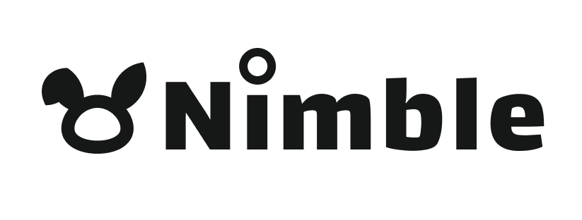
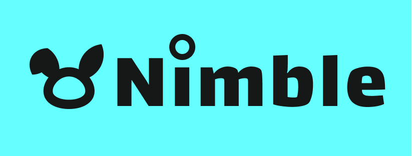
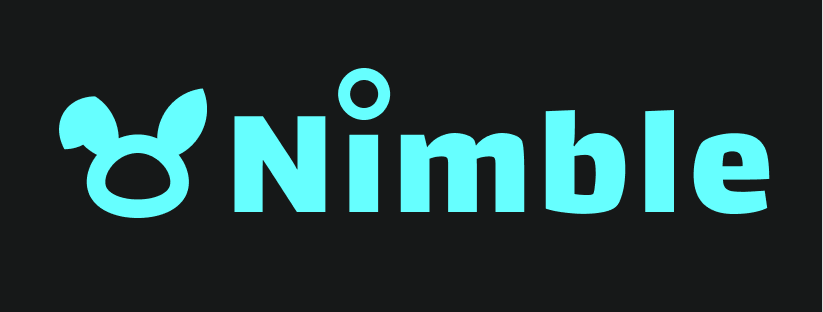

# Branding kit

## Vision

_The internet is the most powerful connective force in history. Billions of people across the globe communicate and transact in real time._&#x20;

_Despite the near-zero marginal cost of online interaction, digital citizens must pay outsized fees to rent-collecting platform middlemen._

_Nimble is eliminating the boundary between the mainstream and decentralized web. Our intent-powered marketplace will provide a neutral accessibility layer to enable seamless access to decentralized services. A competitive ecosystem of sovereign infrastructure providers and end users replaces centralized platforms._

_In the same way that Google made the world’s data accessible to all, Nimble aims to democratize the exchange of value._

## Icons

<figure><figcaption></figcaption></figure>

<figure><figcaption></figcaption></figure>

## Logos

<figure><figcaption></figcaption></figure>

<figure><figcaption></figcaption></figure>

<figure><figcaption></figcaption></figure>

## Color Palette

<figure><figcaption></figcaption></figure>

