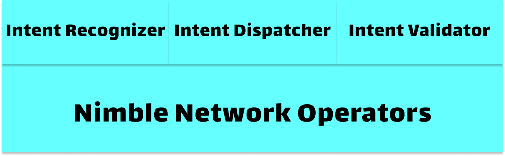

# Decentralized Intents - Intent Operators and Validators

<figure><figcaption>
<strong>Figure 6:</strong> The intent network is decentralized with network operators and PoS consensus mechanisms. Each operator is a physical machine, running one or more of the following intent modules: intent recognizer, intent dispatcher, and intent validator.
</figcaption></figure>

The Nimble network is a set of operators forming an overlay network and running intent processing and reaching consensus for intent operations. There are three protocol modules: intent recognizer, intent dispatcher and intent validator. Each operator is a physical machine on top of which multiple conceptual modules can be run. The overlay network adopts gossip protocols and distributed hash tables.

Intent validator is a network module running on network operators. Proof of Stake consensus is the key logic implemented by the intent validators. Validators reach consensus about intent operations instead of blockchain transaction themselves.&#x20;

To participate in the network consensus validation, validators must have a minimum required amount of staked Nimble tokens. The staked amounts proportionately affect the _2f + 1_ stake weighted _PoAv_ during intent dissemination as well as vote weights and leader selection during intent recognition and ordering. Validators decide on the split of rewards between themselves and their respective stakers. Stakers can select any number of validators in which to stake their tokens for a pre-agreed reward split. At the end of every epoch, validators and their respective stakers will receive their rewards via the relevant on-chain modules. Any validator operator with sufficient stake can freely join the Nimble consensus. All parameters, including the minimum stake required, can be set by the network enablement processes.
