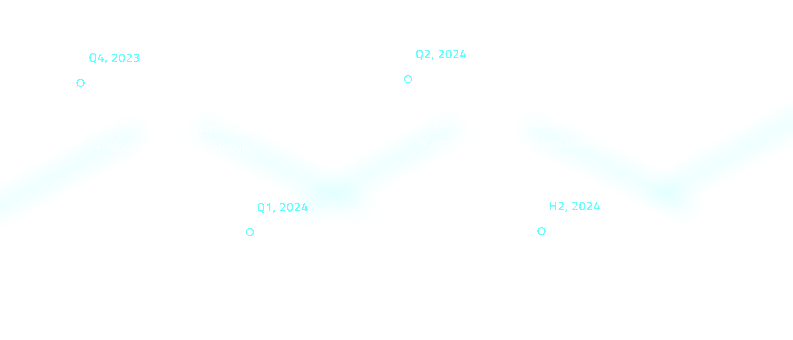

# Roadmap

<figure><figcaption>
Launch the network first and then build for the community
</figcaption></figure>

The above roadmap may just mean nothing to you - another boring and typical network launch timeline. You are correct. The team will build with it as a reference, but more importantly we take an _ecosystem first_ approach. Users, solvers and community members are the core of the Nimble ecosystem.

What does it mean to users, solvers and community members?

#### For users

You can start using our product by the end of November, 2023. We will then build features you want. You can ask on Discord and Twitter and we will prioritize!

#### For solvers

You will be able to participate in the network starting the end of November 2023. After that, what intents you can solve depend on what users want. We are here together to serve users.

#### For community

You may also care about tokens. We do not have an exact timeline yet. When to launch the network token depends on how fast we grow together. Let us cheese!

_Let us build and shape the future of Nimble together!_
