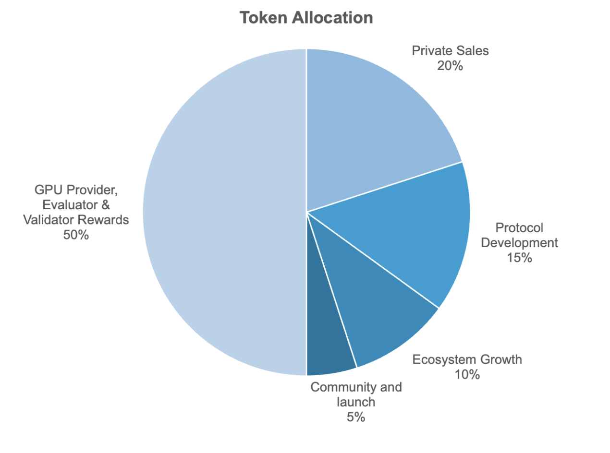

# Nimbus Communities

Nimble aims to build the Marketplace of Intents. A marketplace provides a neutral forum for buyers and sellers to exchange value, but the marketplace itself is merely infrastructure - it’s the participants that bring the place to life.

This document outlines how we will kickstart the growth of the Nimble Intent Network, while enabling use cases in e-commerce, crowdfunding, cultural groups, and more.


Nimbus Introduction


## Community in Web3

We believe the best path to growth begins by partnering with Web3’s existing communities.

Meme token holders, owners of NFTs in exclusive collections, and DAO members often have tight bonds with the members of their groups.

Participants feel passionately about the projects they participate in. Often community members will dispel doubt, correct misconceptions, and help new or prospective members. They behave like partners, increasing the value of their holdings through their interactions.

For the most part, token holdings have no utility. Even tokens from major infrastructure projects have limited utility due to the lack of traffic on the underlying networks.

We are building a tool that provides a real use for community members’ token holdings, while simultaneously kickstarting traffic on our intent protocol.

## Introducing Communities

Nimble Communities is the first-ever intent driven SocialFi app. It unlock the utility of meme tokens and NFTs by providing a home for token holders to organize, collaborate and create.

Instead of swapping your tokens, now you can put them to work.

### How it works

#### Joining

Access to communities is governed by memberships. You can buy a membership by following an invite link sent by an existing community member, and paying using the native token of the community to pay. At launch, we will support a small set of meme tokens starting with SHIB.

The price of a membership is governed by an inverse exponential bonding curve. Membership prices will increase quickly for founding members, then become relatively stable. This stable price structure is crucial to ensure long-term growth of each community, and to incentivize early participation.

<figure><figcaption>
Membership bond curve to calculate the price.
</figcaption></figure>

Memberships are represented on-chain by a unique NFT corresponding to the community. The tokens used to purchase the membership are placed into a community treasury for future allocation by community members.

#### Treasury

Each community has a pool of resources called a community treasury. Funds are placed into the treasury through the minting of new memberships, or through direct funding by community members.

The community funds are for future protocol development, community growth and network upgrades through a community DAO.

Treasury funds may be used by the community to fund initiatives such commissioning work, purchasing assets, funding contests, or any other project the community decides.

#### Posting

Members can engage by sharing content with their community. Posts can either be discussions or propositions. Discussion posts can be used to chat or collaborate with community members, while propositions can be used to direct funds from the community treasury.

#### Earning

Membership entitles users to a share of the revenue generated by the community. Revenue is generated whenever a community member boosts a post.

Post boosting is a mechanism for advertisers to promote their content within a community. Revenue is sent directly from the advertiser to community members in proportion to the number of shares owned by the members.&#x20;

### Release Date

Communities will be released Q4-23, with incremental releases continuing through Q2-24.

### Social Intents

Community actions will be used to direct the development of social intents.

Users express intents in the community app through posting, advertising, and voting. These actions will be incrementally codified as intents, and made available within the modular auctions of our Marketplace.

<figure><figcaption>
Intents are general purpose with modular auction design.
</figcaption></figure>

Developers can create new UIs and middleware through the marketplace to provide better experiences and services for end-users. Middleware can take many forms, including:

* AI models for content recommendation and advertising
* Content discovery

Feedback from users will guide the incremental development of additional social intents to enable exciting new use cases.

We will open-source the community application once social intent operations are fully functional.

## Incentive Plan

<figure><figcaption>
Incentives are provided to kickstart community and intent demand
</figcaption></figure>

### Rewards

Community is vital for any Web3 project, and we want to ensure each member is well rewarded for helping this project grow and thrive long-term.

This post describes our current active incentives and how they’ll translate to network rewards in the future.

### Phases

Rewards are divided into four phases. Each phase emphasizes a different type of community growth.

#### **Phase 1**

To kickstart the network, we need to onboard users to submit their intents. That’s why the first phase of our incentive plan is all about Community Growth.

Here’s how it works:

* Earn XP by participating in events in the Nimble Community Discord
* When the Communities App launches, your roles will translate to XP in the app.
* Users with sufficient XP will qualify for revenue sharing in their communities

Prior to launch, roles will be purged for inactive community members or bot accounts.

In the first phase of the growth plan, we will prioritize user onboarding. During this first phase, users will act as solvers for other users. Sharing, discovery, and advertising will be simple.

Once the network has sufficient user intents, we can begin onboarding solvers to offer advanced functionality.

#### **Phase 2**

In phase 2, solvers will be onboarded to provide middleware on top of the intent protocol. Content recommendation algorithms, improved advertising, and better ranking will be supported.

Incentives in phase 2 will incentivize

* Solver developers with a proven track record of developing dApps
* User activity on our intent network and community app

#### **Phase 3**

In phase 3, we will focus on expanding our breadth of supported intent operations. The roadmap at this stage will be directed by user feedback.

Incentives will prioritize continually active users and onboarding developers to build functionality on the newly supported intent operations.

#### **Phase 4**

The goal of the final phase of our incentive plan is to encourage use of dApps built on top of Nimble. Users will be rewarded for submitting intents to dApps built on the Nimble Protocol.

#### Distribution

Network tokens will be distributed after each phase of the incentive plan. Each distribution will be larger than the one that preceded it.

## Exchange Listing

Once the use cases of the network are well established, top exchanges can be used to introduce trading volume on the network. The team has significant experience working with exchanges to have tokens listed.

By focusing on investors who are long-term holders, crypto market makers, and top exchanges, we can promote long-term stability and growth of the token’s value.

## General Purpose Intents

After jumpstarting the network with the above strategy, intents are extended to more use cases like AI, DeFi, investment, creators, RWA and other marketplace applications.

\
